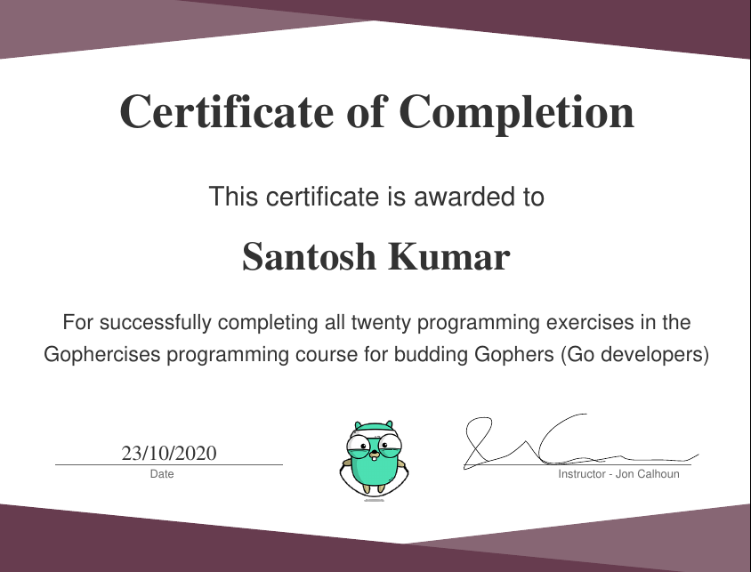

# gophercises

Go exercises from <https://gophercises.com> offers learning by doing. I have completed this course and found it very engaging. 

Screenshot and/or code demos are available in their own sub directories.

Following are the exercises covered.

## [Quiz Game](./quiz/README.md)

This application reads from a CSV file (default: problems.csv). Each row is have a question in the first column and answer in the second. There is a default 30 seconds timer after which quiz will end. Results shows how many questions were asked and how many of them were correct.

## [URL Shortner](./urlshort/README.md)

A BoldDB backed URL Shortner. Fallbacks to YAML and JSON seed files when no BoltDB database is provided.

## [Choose Your Own Adventure](./cyoa/README.md)

Web simulation of the famous book Choose Your Own Adventure. The story is fed via a JSON input.

## [Link Parser](./link/README.md)

Fetches `href` and `text` from an `<a>` tag to a custom `Link` data structure. This library is used in the next exercise.

## [Sitemap Builder](./sitemap/README.md)

Built on top of Link Parser is Sitemap Builder. It crawls and finds all the links n devel deep and generate sitemap with all the links. Uses BFS algorithm.

## [Hacker Rank Problem](./hr/README.md)

Solves Camel Problem and Cipler Problem from HackerRank. The idea was to use services like HackerRank, LeetCode and Project Euler to work on algorithms and data structures.

## [Task Manager](https://github.com/santosh/cotu)

Task manager is now morphed into <https://github.com/santosh/cotu>, a utility to use daily use app via command line.

## [Phone Number Normalizer](./phnorm/README.md)

This lesson is designed in a way to teach interaction with SQL databases in Go.
Uses Postgres with <https://github.com/lib/pq>.

## [Deck of Cards](./deck/README.md)

The `deck` package, which will be used in future card game exercises. Implements Suit, Rank and Card types.

## [Blackjack](./blackjack/README.md)

Using the `deck` module, implements a simple version of the Blackjack game.

## [File Renaming Tool](./renamer/README.md)

A tool used to rename files with a common pattern. Eg we might want to take many files with names like “Dog (1 of 100).jpg”, “Dog (2 of 100).jpg”, … and rename them to “Dog_001.jpg”, “Dog_002.jpg”, …

## [Quite Hacker News](./quiet_hn/README.md)

Take <https://github.com/tomspeak/quiet-hacker-news>, and make it fast by adding caching and concurrency.

## [Recover Middleware](./recover/README.md)

HTTP middleware that recovers from panic in an application.

## [Recover Middleware w/ Source Code](./recover_chroma/README.md)

Expand upon the recover middleware and add links to source code along with syntax highlighting of the source code in order to make a useful development tool.

## [Twitter Highlight Contest CLI](./twitter/README.md)

Create a CLI to help run a Twitter contest where users retweet a tweet for entry, and after some time you pick one or more of the users who retweeted as the winner.

## [Secrets API & CLI](./secret/README.md)

Create a package that handles storing and retrieving encrypted secrets like API keys. Then use that package to create a CLI that can be used to set and get secrets stored in a file in your home directory.

## [Image Transform Service](./transform/README.md)

Create a web server where a user can upload an image and then go through a guided process of choosing various image transformation options they prefer to get a final version of their image.

## [Building Images (png & svg)](./image/README.md)

Learn to create images in your Go code. First we use the standard library to build a simple PNG bar chart, then we explore how to use an awesome third party library to create a much more complex and compelling chart in SVG format.

## [Building PDFs](./pdf/README.md)

In this exercise we learn to create almost any PDF in Go. We start off by building an invoice with a dynamic set of line items, and then we move on to creating a course completion certificate for the Gophercises course!

