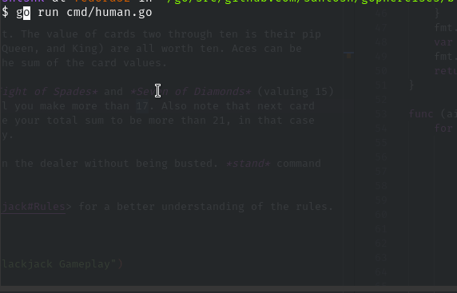

# Blackjack & Blackjack AI 

This Blackjack is a simulation of the real blackjack game. 

This exercises is one of the most complex in this series. Two exercies are are combined into one to keep things neat. You can go through the commit history if you are looking for pure Blackjack; Blackjack AI is the current state of the repository.

## Usage

Go to `cmd/` and run the `human.go`. Follow the on-screen instructions. You can set the number of hands (number of times you want to play) in the `main` routine.

1. At the start of the game, you'll be presented with a prompt which will ask you how much to bet.

```
$ go run cmd/human.go
The deck was just shuffled.
What would you like to bet?
```

Enter a number above 100. If you win, you'll get this number multiplied by `BlackjackPayout` (see `human.go`).

2. Each card has values assciated with it. The value of cards two through ten is their pip value (2 through 10). Face cards (Jack, Queen, and King) are all worth ten. Aces can be worth one or eleven. A hand's value is the sum of the card values.

You will be dealt a set of cards, say *Eight of Spades* and *Seven of Diamonds* (valuing 15). You have to keep hitting at least until you make more than 17. Also note that next card might be some valued card which will make your total sum to be more than 21, in that case you will be busted and lose all you money.

You have to make sure you score more than the dealer without being busted. *stand* command will make dealer stop dealing cards.

See <https://en.wikipedia.org/wiki/Blackjack#Rules> for a better understanding of the rules.

## Screenshot


