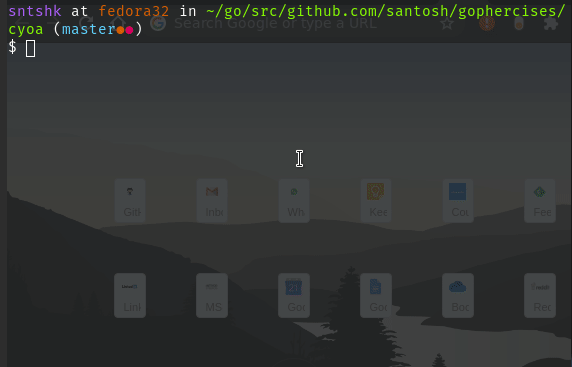

# Choose Your Own Adventure

This program let's you play CYOA in your browser. 

This lesson covers JSON unmarshalling, variadic functions and basic templating.

## Usage

```
usage: cyoaweb [-h|--help] -f|--file "<value>" [-p|--port <integer>]

               Web version of The Little Blue Gopher. A choose your own
               adventure type game.

Arguments:

  -h  --help  Print help information
  -f  --file  File to use for story. 
  -p  --port  Port to start the CYOA webapp on.
```

You can make your own story. See the format of `gopher.json` for the same. 

## Screenshot


