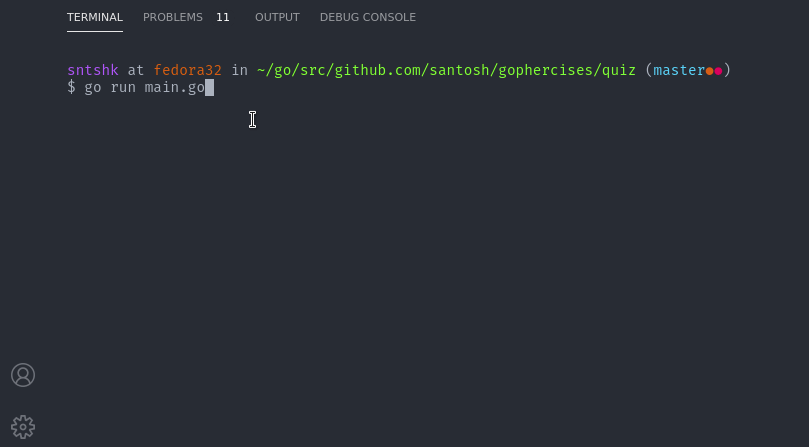

# Quiz Game

This application reads from a CSV file (default: problems.csv). 

```csv
5+5,10
7+3,10
1+1,2
8+3,11
1+2,3
8+6,14
3+1,4
1+4,5
5+1,6
2+3,5
3+3,6
2+4,6
5+2,7
```

Each row is have a question in the first column and answer in the second. There is a default 30 seconds timer after which quiz will end. Results shows how many questions were asked and how many of them were correct.

## Screenshot


