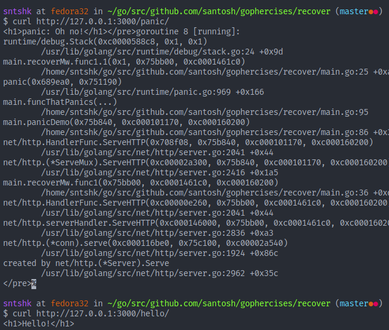

# recover

This exercise demonstrates how we can recover from panic in production. Additionally, it also demonstrates to recover from partial output where some of the data is already written to the response writer before panicking.

Depending on dev mode, it shows a stack trace or a generic response to the client.

## Usage

Change `dev` value of `recoverMw` to `false` and access the registered routes. Again change it to `true` and see the difference.

## Screenshots

**When dev mode is off.**

**When dev mode is on.**

