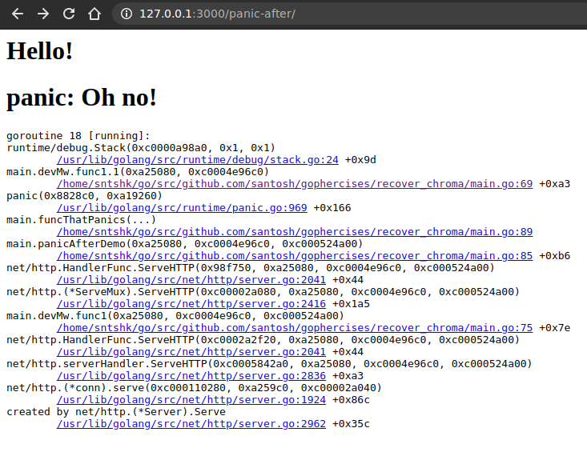
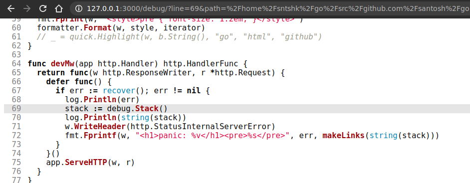

# recover_chroma

recover_chroma is more visually pleasing version of our last [chroma](../recover/README.md) exercise. 

In this exercise, we have extended our *developer mode* to show stack traces with links to the file + line number where the error has actually occurred. We are using syntax highlighting library *chroma* for doing this.

## Usage 

Run the server with `go run main.go`.

## Screenshots

**Screenshot showing stack trace.**

**Screenshot highlighting line number when one of the link is clicked on the previous page.**

Chroma provides various customizations over the themes and all.
