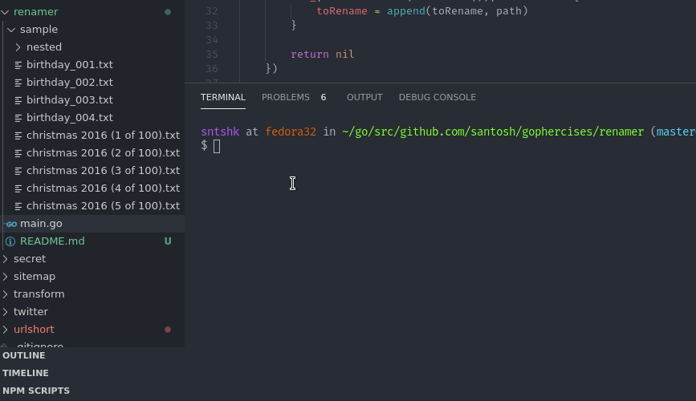

# renamer

*renamer* is a simple (not for production use) regex based file renamer. It works by matching a regex group and moves the order of the group a little bit. Both of which can be modified in first two lines of `main.go`.

By default the dry run flag is set to true, in case you don't actually mess up the disk.

## Screenshot

