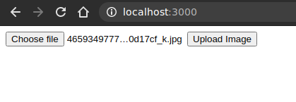
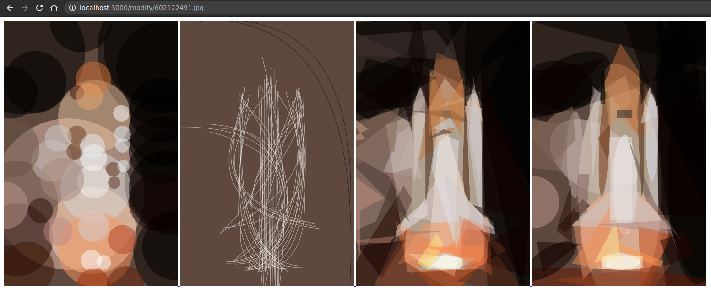

# transform

transform uses primitive library to produce images with geometric primitive. Then it wraps it an interface to serve it via HTTP.

## Usage

- Run the server with `go run main.go`. 
- Head over to <http://127.0.0.1:3000>.

- Upload an image. Here we are using a below mentioned image.

- These are the images returned by the service.

In first image, we are only using circle. In second image we are using strokes; we usually need more number of shapes for image to comes out visible. In third image we just use triangle. In the fourth and the last image uses combinatoin of 1st and 3rd.
