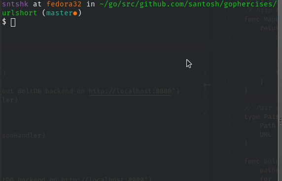

# urlshort

URL shortner with data backstore supporting YAML, JSON, BoltDB. In this example the datastores are chained to each other, first precedence is given to Bold > JSON > YAML > `pathsToUrls`.

## Usage

```
usage: urlshort [-h|--help] [-y|--yaml "<value>"] [-j|--json "<value>"]
                [-b|--bolt "<value>"]

                URL Shortener with multiple data backstores.

Arguments:

  -h  --help  Print help information
  -y  --yaml  YAML file to be used
  -j  --json  JSON file to be used
  -b  --bolt  BoltDB file to be used
```

No flags are needed by default, files starting with urls.ext are automatically used (provided as part of this repo). Every flag is overridable.

To use boltdb in this demo, first you need to generate the bold.db file because I have decided not to include any binary file in the repo:

    go run cmd/generate_urls.db.go

Now you need to run the program like this:

    go run main.go

This program has total 7 urls to test, distributed in various different feeder formats. For sake of testing, following are the `Pair`s of `Path` and `URL`:

```
/li             : https://www.linkedin.com/in/sntshk
/so             : https://stackoverflow.com/u/939986/
/urlshort-godoc : https://godoc.org/github.com/gophercises/urlshort
/yaml-godoc     : https://godoc.org/gopkg.in/yaml.v2
/gh             : https://github.com/santosh
/tw             : https://twitter.com/sntshk
/site           : https://santoshk.dev
/fr             : https://www.flickr.com/sntsh
/ddg            : https://duckduckgo.com
```

First two links are in generated from urls.db.


## Screenshot   

Here is the demo of the entire thing working together.


